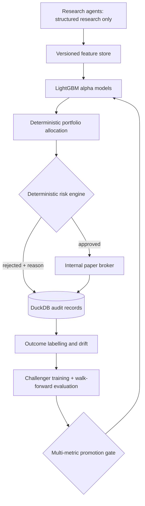

# Architecture

## Safety boundary

There is no live-broker adapter. Agents terminate at structured research features and have no
reference to the execution layer. Allocation, risk approval, kill switch, fills and accounting are
deterministic code. DuckDB is hidden behind a repository boundary so a later PostgreSQL adapter can
implement the same append/list contract.
